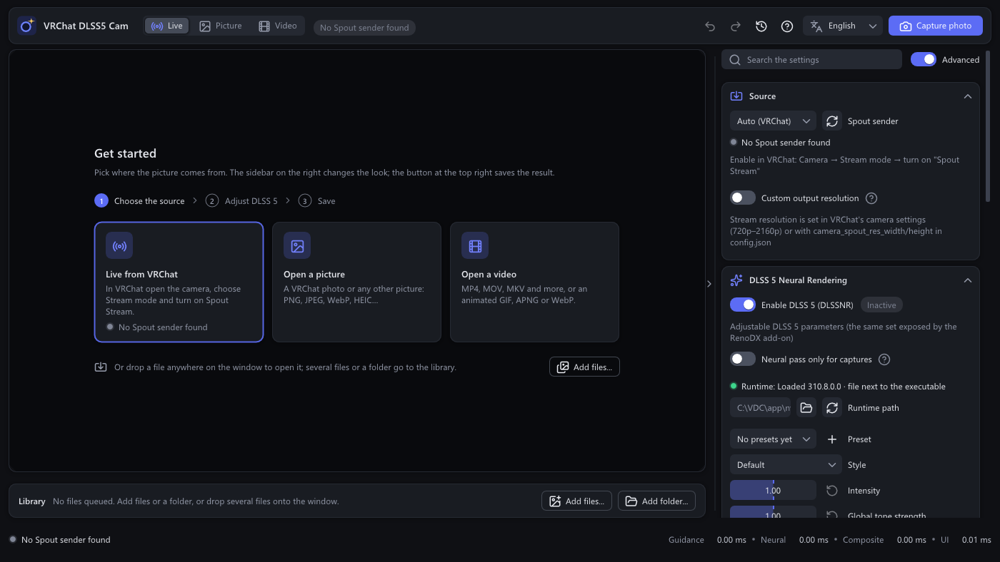

<p align="center">
  
</p>

# VRChat DLSS5 Cam

**English** · [简体中文](docs/README.zh-CN.md) · [日本語](docs/README.ja.md) · [한국어](docs/README.ko.md)

VRChat DLSS5 Cam applies NVIDIA **DLSS 5 Neural Rendering** to the output of VRChat's camera on a GeForce RTX card
and records the result as a lossless PNG. Images and videos on disk pass through the same pipeline, individually or
as a batch. It is an ordinary Windows application: the VRChat process is never touched, and no mod is required.

<p align="center">
  
</p>

[](https://github.com/AlanBacker/VRChat-DLSS5-Cam/actions/workflows/build.yml)
[](https://github.com/AlanBacker/VRChat-DLSS5-Cam/releases/latest)

## Features

- **Live camera.** VRChat's Stream Camera is received over Spout and previewed in real time with DLSS 5 applied.
  A global hotkey (`Ctrl+Alt+P`) saves a lossless PNG while VRChat stays in the foreground.
- **Images and video files.** Screenshots and recordings can be dropped onto the window, adjusted and exported:
  PNG for stills, MP4 (H.264 / HEVC, audio track preserved), a PNG sequence or an animated GIF / APNG / WebP for video,
  named by a template of your own. Animated GIF, APNG and WebP files are processed frame by frame like videos and come
  back in the same format, with the timing of every frame kept.
- **Batch processing.** Every file that is opened is collected in the library below the preview. Any selection can
  be processed in a single run, either with the shared parameters or with per-file parameters, and each file can be
  turned, mirrored or cropped beforehand.
- **Real DLSS 5 guidance.** Motion vectors from NVIDIA Optical Flow, or from the FSR optical flow of this program on any
  card, and a depth map from Depth Anything V2 are
  supplied to the network, so video and the live camera are processed with the same temporal cues a game would
  provide. An optional DLAA pass can clean up edges first.
- **Comparison and inspection.** Wipe, side-by-side and original views, wheel zoom, drag panning and a fullscreen
  mode make the difference before and after processing verifiable at 1:1.
- **Built for daily use.** A start page that leads through the first steps, a flat interface in dark and light
  themes that follow the Windows setting, one *Advanced* switch for everything beyond the essentials, undo and redo
  with a full history, user-defined presets, a search across every setting, a resizable layout that stays readable
  in a narrow sidebar, an automatic update check, four languages (English, 简体中文, 日本語, 한국어), a dedicated
  interface thread for a consistently responsive window, and a command line for scripted runs.
- **Light on the computer.** While nothing changes, the window redraws only a few times a second; the live camera is
  read only when VRChat has sent a new frame; and the depth network is loaded only while DLSS 5, DLAA or the depth
  view needs it.

## Requirements

| | |
|---|---|
| Windows | Windows 10 21H2 or Windows 11, 64-bit |
| Graphics card | NVIDIA GeForce RTX. The **RTX 50** series and the **RTX 40 / 30 / 20** series each have a build of the runtime in the archive (next row), so nothing has to be added for any of them. **AMD Radeon RX 7000 / 9000** with the Radeon edition (`VRChatDLSS5Cam-win64-amd.zip`), which runs the neural pass through DLSS-NR-on-AMD, a separate project installed from the application (see *AMD Radeon cards*). Cards from other vendors are not refused: the application works as a viewer and recorder on them. DLAA and the hardware optical flow stay NVIDIA-only; the FSR optical flow takes over as the motion source. |
| DLSS 5 runtime | Included. The archive carries `nvngx_dlssnr.dll` 310.8.0.0 in two builds: `runtimes\blackwell\` holds the build as shipped with games (RTX 50) and `runtimes\universal\` a community-adapted build of the same runtime for RTX 40 / 30 / 20. The build for the installed card is chosen at start and the other is tried when it fails. Both files are NVIDIA's software under NVIDIA's terms and are not part of this project's MIT-licensed source (see `THIRD_PARTY_NOTICES.md`); nothing has to be obtained from anywhere else. |
| VRChat | Any build with the Stream Camera *Spout Stream* option (desktop or VR). Required for the live camera only. |
| Video files | Windows Media Foundation (part of Windows). The N / KN editions require the *Media Feature Pack*; HEVC files may require the *HEVC Video Extensions* from the Microsoft Store. Animated GIF, APNG and WebP files need nothing extra: the application decodes and writes them itself. |

## Getting started

| Your graphics card | Download | Notes |
|---|---|---|
| NVIDIA GeForce RTX 20 / 30 / 40 / 50 | `VRChatDLSS5Cam-win64.zip` | The DLSS 5 runtime is in the archive. |
| AMD Radeon RX 7000 / 9000 | `VRChatDLSS5Cam-win64-amd.zip` | The Radeon edition; it fetches DLSS-NR-on-AMD's installer for you at the first start. See [AMD Radeon cards](#amd-radeon-cards) for what to expect. |
| Linux with an NVIDIA card | `VRChatDLSS5Cam-linux-x86_64.tar.gz` | The GeForce edition running under Proton, with a launcher that sets Proton up by itself. Pictures, videos and MCP work; there is no live (Spout) mode and videos are saved as WebP, GIF, APNG or PNG. See [Linux](docs/LINUX.md). |

1. Download `VRChatDLSS5Cam-win64.zip` from the [latest release](https://github.com/AlanBacker/VRChat-DLSS5-Cam/releases/latest) and extract it to any location. (Radeon card: `VRChatDLSS5Cam-win64-amd.zip` instead, see *AMD Radeon cards* below.)
2. Nothing else has to be copied. The DLSS 5 runtime is in the archive under `runtimes\`, in one build for RTX 50
   and one for RTX 40 / 30 / 20; the application picks the build for the installed card at start and switches to the
   other one when that fails. The build in use is named next to *Runtime* in the DLSS 5 section, and the path is
   recorded in `log.txt`.

   ```
   VRChatDLSS5Cam.exe
   runtimes\blackwell\nvngx_dlssnr.dll   RTX 50
   runtimes\universal\nvngx_dlssnr.dll   RTX 40 / 30 / 20
   runtimes\other\nvngx_dlssnr.dll       a runtime for another vendor (not included; Radeon cards use the Radeon edition)
   ```

   A file of your own can be used instead: `nvngx_dlssnr.dll` next to `VRChatDLSS5Cam.exe` is tried after the build
   for the card, and any file can be selected under *DLSS 5 Neural Rendering → Runtime path*.
3. In VRChat, open the **Camera**, switch it to **Stream** mode and enable **Spout Stream** in its settings.
4. Start `VRChatDLSS5Cam.exe`. The first start opens a short setup guide (language, GitHub access, what the controls do). The camera picture then appears in the preview with DLSS 5 applied, and the badge next to the *Enable DLSS 5* switch reads *Active*.
5. Frame the shot in VRChat and press **Ctrl+Alt+P** (or use the *Capture photo* button). The PNG is written to `Pictures\VRChat DLSS5 Cam`.

While nothing is open, the preview shows the **Get started** page: the three steps (choose the source, adjust DLSS 5,
save) and a tile for each way in. *Live from VRChat* switches to the live camera and says whether a Spout sender is
there; *Open a picture* and *Open a video* open a file. A file dropped anywhere on the window opens as well, and
several files or a folder go to the library.

<p align="center">
  
</p>

Notes on the live camera

- The stream resolution is decided by VRChat. Raising `camera_spout_res_width` / `camera_spout_res_height` in VRChat's `config.json` produces a sharper input, and the application adapts to it automatically.
- When the neural pass is too slow for a live preview on a given card, *Neural pass only for captures* in the DLSS 5 section keeps the preview on the plain picture with the neural, motion and depth passes at rest, and runs the neural pass for each capture only.
- *Processing rate cap* in the *Display* section limits how many camera frames per second are processed, which keeps the GPU free for VRChat.
- Both are expert controls: they are shown while the *Advanced* switch at the top of the sidebar is on (the default).

## AMD Radeon cards

The Radeon edition, `VRChatDLSS5Cam-win64-amd.zip`, runs the neural pass on Radeon cards through
[DLSS-NR-on-AMD](https://github.com/danielblnc/DLSS-NR-on-AMD), a separate project by Daniel Blanco that brings DLSS 5 neural rendering to AMD hardware by
attaching to programs that use FSR. Nothing of that project is included here: the edition hosts an FSR context (AMD's FidelityFX API,
`amd_fidelityfx_dx12.dll`, MIT) for it to attach to, and fetches its installer from that project's own release page when you press the button.
That project's [licence](https://github.com/danielblnc/DLSS-NR-on-AMD/blob/master/LICENSE) allows personal, non-commercial use and no redistribution
or modification, which is why its installer is never part of this archive.

1. Download `VRChatDLSS5Cam-win64-amd.zip` from the [latest release](https://github.com/AlanBacker/VRChat-DLSS5-Cam/releases/latest) and extract it to any location. It carries
   `amd_fidelityfx_dx12.dll` and the RTX 50 build of `nvngx_dlssnr.dll` next to the executable (the installer of step 2 converts that file into
   its own weights); the NVIDIA-only files (`nvngx_dlss.dll`, `runtimes\`) are not in it. The GeForce edition offers **Get the Radeon edition…**
   when it finds itself on a Radeon card (`--edition amd` on the command line does the same) and swaps its files the way an update does.
2. Start `VRChatDLSS5Cam.exe`. The start-up card and the DLSS 5 section offer **Install DLSS-NR-on-AMD…**, with the licence linked next to it.
   One press downloads `dlssnr_on_amd_setup.exe` into the program folder and runs it in the background, taking the folder and the DLL name it
   proposes for the executable; no window and no key press are needed. When it has finished, the application restarts by itself, and the DLSS 5
   section reads *Runtime: Loaded FSR … · FSR host* and *DLSS-NR-on-AMD v…: loaded (version.dll) · up to date*, with the badge next to
   *Enable DLSS 5* reading *Active*. If the folder needs administrator rights, or the card is one the port does not support, the installer opens
   its own window instead so its message is visible.

The DLSS 5 section shows the installed release next to the latest one. When a newer DLSS-NR-on-AMD is out, the section says so and the button
reads **Update to …**; it and **Run the installer again…** fetch the installer and open its window, where **U** updates (keeping the settings and
weights) and **R** removes it. An installation made before this version is recognised by the installer file next to the executable.

On this route the strengths of the neural pass up to 1 belong to DLSS-NR-on-AMD and are set in its own overlay (**End** key; its *Mode* there
stays at inline, which a saved frame needs, see below); this application's *Preset*, *Style* and strength values
are not passed to it. The controls that act after the pass (*Output blend*, strengths above 1, *Neural pass resolution*) work as usual.
DLSS-NR-on-AMD needs Windows 11, a Radeon RX 7000 or RX 9000 card and Adrenalin 26.1.1 or newer; its release page states the current
requirements. The Radeon edition always runs the FSR host; the GeForce edition hosts `nvngx_dlssnr.dll` itself. There is nothing to choose, and each
edition points to the other one when it finds the other vendor's card.

The Radeon edition has been run on an RX 9060 XT: still pictures at 720p and 4K, video files, batch processing from the command line and
the live VRChat camera (at a lower frame rate than on a GeForce card; see the list below). DLSS-NR-on-AMD's installer sets an inline budget of 200 ms, suited to a game, after
which a frame shows the previous frame's result; the application raises `InlineWaitMs` in `dlssnr_on_amd.ini` to 1000 after the install
(or at start-up, with one automatic restart, when the file still has a lower value) so that a saved picture or video frame carries its own
result, and keeps `Inline` at 1 there. Nothing else in that file is changed. `log.txt`
(`%LOCALAPPDATA%\VRChatDLSS5Cam\`) lists the DLSS-NR-on-AMD files next to the executable and ends with the last lines of that project's own
log (`dlssnr_on_amd.log` in the program folder); reports with it are welcome in the issues.

### What to expect on Radeon in this version

- **Cards.** Radeon RX 7000 and RX 9000 on Windows 11 with Adrenalin 26.1.1 or newer, the cards DLSS-NR-on-AMD supports; the author's
  tests ran on an RX 9060 XT. On an older Radeon the FSR host still runs, but without the port's network, and the picture comes back unchanged.
- **Works.** Still pictures, video files, the batch queue, the live VRChat camera with captures and timelapses, the depth network, the controls
  after the pass (*Output blend*, strengths above 1, *Neural pass resolution*), updates and the edition switch.
- **Slower.** DLSS-NR-on-AMD runs its network inline and the frame waits for it: about 25 ms at 720p and 180 ms at 4K on the RX 9060 XT,
  so a 4K live picture reaches a few frames per second. A *Maximum resolution* cap under *Neural pass resolution* and the *Processing rate
  cap* keep the live picture fluid; saved pictures and videos come out the same, only later.
- **FSR optical flow in place of the hardware engine.** The optical flow engine belongs to the GeForce driver and has no
  counterpart on Radeon. Since 1.8.0 the motion vectors come from the FSR optical flow instead, a pyramid of compute
  passes of this program's own in the shape of the optical flow of the AMD FidelityFX SDK (MIT): it follows fast motion
  far better than plain block matching and checks its vectors in both directions. It is what the Radeon edition starts
  with, and *Search radius* and the bidirectional check under *Frame guidance* trade its GPU time against quality.
- **Strengths and presets.** The port keeps its own *Preset*, *Style* and strengths up to 1, set in its overlay (**End** key), as described above.
  Moving those sliders here therefore composites the existing result at once (values above 1 take effect in the composite) instead of
  running the picture through its passes again, which on a Radeon costs about four seconds at 4K for no change in the picture.
- **The depth network and the port take turns.** The port's network and the depth network (DirectML) do not share the card: a neural
  pass that ran alongside the estimator's warm-up stretched from 0.17 s to 2.7 s, past the driver's two-second limit, and the
  graphics device was lost (the driver restarts, the program has to be started again). Since v1.5.0 the program waits for the
  estimator before every neural pass, so the two never overlap; the first passes of a picture start once the estimator is ready.
  The three-second stall of one frame seen earlier in a 4K batch, a watchdog spike in the port's log, was the same overlap.
- **Idle load.** Once a picture has run its passes the card idles (about 2 % on the RX 9060 XT, the same as on a GeForce). One CPU
  core, though, stays busy from the first neural pass until the program closes: a thread of DLSS-NR-on-AMD polls the card at full
  speed (its inline mode). That thread belongs to the port; releasing the FSR context does not end it.

## Images and video files

A file can be dropped onto the window or opened with *Open image…* / *Open video…* in the *Source* section. The
picture appears in the preview and every slider takes effect on it immediately. The ✕ button beside *Open…* closes
the file again: processing stops, the preview empties and the file stays in the library. **Process & save PNG**
(images), **Process & save video** (videos) or the hotkey writes the result next to the source file as
`<name>_DLSS5_<w>x<h>.png`, `.mp4`, `.gif` / `.png` (APNG) / `.webp` for an animation, or a folder of PNG frames.

<p align="center">
  
</p>

For video, the controls under the preview play and pause the file through the whole pipeline, step one frame at a
time, and show a thumbnail of the frame under the cursor on the seek bar. *Start here* / *End here* limit the
processing (and the audio) to a range, and *Whole video* clears it. By default the output matches the source: same
codec, frame rate and bitrate. With *Match the source* switched off, H.264, HEVC, a PNG sequence, GIF, APNG or WebP
and the bitrate can be chosen manually. The *Capture* section shows roughly how long the file will take with the
current settings.

An animated GIF, APNG or animated WebP opens as a video: the same play, step and range controls apply, and every frame
keeps its own display time. With *Match the source* the result is written in the same format with the file's loop
count (a lossless WebP stays lossless); with it off, any moving source can be saved as MP4, a PNG sequence, GIF, APNG
or WebP, and *WebP quality* sets the compression (100 = lossless). Transparency is kept when *Keep transparency
(alpha)* is on (GIF: one bit). A GIF holds 256 colours per frame and at most 50 frames per second.

## Batch processing

Every file that is opened or dropped is collected in the **library** below the preview; *Add files…* and *Add
folder…* add more; while it is empty, the library is a single row with those buttons and opens with the first file.
A **double-click** on a thumbnail opens that file in the preview for adjustment. A single click selects it alone,
**Ctrl+click** adds or removes one file, **Shift+click** extends the selection from the file clicked last, dragging on
empty space draws a selection rectangle, and a click on empty space clears the selection. The box that appears at a
thumbnail's corner under the mouse (and on every thumbnail while any is selected) ticks it, the ✕ at its other
corner takes it out of the library, and **Ctrl+A** or *Select all* in the **…** menu selects every readable file.
The **Delete** key or the *Delete* button takes the selected files out of the library while the mouse is over it (or
after the last click was inside it); the files themselves stay on disk. *Process selected* or *Process all* then runs
the files one after another, with a bar on each thumbnail showing the progress and the state remaining visible
afterwards. In a narrow window the header's buttons shrink to icons, and those that no longer fit move into the
**…** menu.

The right mouse button opens a menu on a thumbnail: show the file in Explorer, take it out of the library, or give
it **its own DLSS 5 parameters** in a separate window. With several files selected the same menu offers *Own
parameters for N files…*, which sets the values for all of them at once; each file keeps its own copy afterwards.

A small toolbar over the preview of a library file **turns, mirrors and crops** it: a quarter turn to the left or
right, a horizontal or vertical mirror, or a crop frame whose corners and edges are dragged (dragging inside the
frame moves it), confirmed with **Enter** or *Apply* and dropped with **Esc**. The last button restores the file to
its original state. Each file keeps its own orientation and crop, processing and the saved result use the turned
and cropped picture, and every step is recorded in the history and can be undone. The live picture has the same
toolbar without the crop: a turn or mirror of the VRChat camera picture applies to the preview, the captures and the
timelapse alike, and is kept across sessions. The toolbar itself can be moved: drag it by the grip at its left end, and drop it past
an edge of the picture, or press the arrow at its right end, to tuck it away at that edge, where a small tab brings it back. Its place
is kept across sessions as well.

## Working with the interface

- **Three sections cover the everyday work:** *Source* (what comes in), *DLSS 5 Neural Rendering* (how it looks) and
  *Capture* (where it goes), followed by *Display*, *MCP* and *About*; a click on a section's title folds it. The
  **Advanced** switch at the top of the sidebar, beside the search field, shows or hides everything beyond the
  essentials: the tone and structure sliders, the neural pass resolution and the output blend, *Neural pass only for
  captures*, the *Frame guidance* and *DLAA pre-pass* sections, *V-Sync* and the processing rate cap, *Internals* with
  the timers, and the pass timings in the status bar. It is on by default; switched off, the sidebar keeps only what
  a first picture needs.
- **The top bar** holds the source switch (*Live*, *Picture*, *Video*) with a badge for its state and a *DLSS 5*
  badge while the neural pass runs; on the right undo, redo, the history, help, the language and the main action:
  *Capture photo*, *Process & save PNG* or *Process & save video*. The **status bar** at the bottom names what is
  open with its size and frame rate, the progress of a running job with the time left, and the file saved last,
  with a button that shows it in Explorer.
- **Every label fits.** Long names wrap onto a second line instead of being cut, a value or badge with no room left
  moves to the next line, and a button pair that no longer fits side by side is stacked, in all four languages and
  down to the narrowest sidebar.
- **Comparison** is done with the wipe (the handle in the preview is dragged), side by side or the original view.
  The wipe follows the mouse at the interface's own frame rate, even while a video plays slowly. The mouse wheel
  over the preview zooms around the cursor, dragging pans, and a double-click returns to the fitted view.
- **Presets** are created in the DLSS 5 section: *+* saves the current values under a name, the list applies one
  with a click, and every entry can be overwritten with the current values, renamed or deleted. They are kept in
  `presets.txt` in the settings folder.
- **Search** over the settings is available from the field at the top of the sidebar: only the matching controls and
  their sections stay visible. **Esc** or the ✕ clears it.
- **Undo and redo** cover every change to the settings and every file added to or removed from the library, through
  **Ctrl+Z** / **Ctrl+Y** or the two arrows in the top bar. The clock button beside them opens the **History**:
  every recorded change as a list (*Intensity: 1.2*, *Added photo.png*, *Removed 3 files*, *photo.png: own values*),
  with the current state highlighted and the undone states listed dimmed below it. A click on an entry jumps to that
  state, and the later ones remain available until the next change is made, so the history can be traversed in both
  directions. Up to 100 steps are kept.
- **Fullscreen** is entered from the button in the corner of the preview or with **F11**: the picture alone, over
  the whole screen. The video controls appear while the mouse moves, and **Esc** or **F11** leaves. Entering and
  leaving fade, and so does the switch between *Live*, *Picture* and *Video*.
- **Dark or light.** *Theme* in the *Display* section: *System* follows the Windows app colour setting, or *Dark*
  and *Light* can be selected directly.
- **The sidebar** slides away when the gap between it and the preview is clicked (a small arrow in the middle of the
  gap shows the direction), and the gap above the library folds the library the same way. The **thin line along the
  gap's edge** — the one that turns blue under the mouse, where the pointer becomes a resize arrow — is the drag
  target for the sidebar's width or the library's height, and the thumbnails grow or shrink with it. Both sizes are
  remembered for the next start. While a file is being processed the sidebar is locked and offers *Cancel*.
- **Help** is one click away: the *?* button in the top bar (or *Documentation* in *About*) opens this guide in the
  interface's language.
- **At start** a small card with the icon, the name, the version (marked *Pre-release* on pre-release builds), a
  status line and a moving bar shows what the application is doing; the window itself fades in only once its first
  frame is ready, so no blank window appears at the start. The file from the last session is opened again only if
  *Reopen the last file at start* in the *Display* section is on (it is off by default).

<p align="center">
  
</p>

### Keyboard and mouse

| Keys | What happens |
|---|---|
| `Ctrl+Alt+P` | Capture a photo of the live camera, or process the open image or video (global hotkey, changeable in the *Capture* section) |
| `Ctrl+Z` · `Ctrl+Y` / `Ctrl+Shift+Z` | Undo · redo a settings change or a library change (the clock button in the top bar lists them all) |
| `F11` · `Esc` | Fullscreen preview · leave it |
| `Ctrl+A` · `Delete` | Select every readable file in the library · take the selected ones out of it, keeping the files on disk (mouse over the library) |
| `Space` | Play / pause the open video |
| `←` `→` (`Shift`: 10 frames) · `Home` `End` | Step through the video · jump to the ends |
| `I` · `O` | Set the start · the end of the range to process |
| Mouse wheel over the preview · drag · double-click | Zoom · pan · back to the fitted view |
| Click a thumbnail · double-click · `Ctrl`+click · `Shift`+click · right button | Select only that file · open it in the preview · add or remove one · extend the selection · open the menu |
| Drag on the library's empty space · click on it | Selection rectangle · clear the selection |
| Click the gap beside the sidebar or above the library · drag the thin line at its edge | Fold or unfold that panel · change its width or height |
| `Enter` · `Esc` while cropping | Apply the crop · cancel it |

## Updates

At every start the application asks GitHub for the newest release on the selected channel and reports it when it is
newer than the running version. Two channels are offered in the *About* section under *Update channel*: **Stable**
(full releases only) and **Pre-release** (also the builds published for testing before a full release; full releases reach this
channel too, and the update window marks each release *Full release* or *Pre-release*). *Check for
updates at start* switches the check off, the *Check for updates* button runs it at any time, and the result of the
last check is shown underneath.

Where GitHub is slow or unreachable (mainland China, for one), *GitHub access* in the same section switches the check
and the download to a mirror site: **Mirror sites, the fastest one** measures eight known sites and uses the one that answers
fastest (the *Measure the sites* button shows the result of each), **A mirror site of my own** takes a site of your own, and
**GitHub directly** talks to GitHub itself. When no site answers, a window offers the other choices. Through a mirror the
program reads the release list `updates.json` that this repository keeps in step with the releases. In the Radeon edition the
look-up of DLSS-NR-on-AMD's latest release and the download of its installer go through the chosen site as well (the entry
comes from `port.json`, which this repository refreshes daily).

When a newer version exists, a window shows its version, its date and its release notes with three buttons.
**Update now** downloads the release zip into `%LOCALAPPDATA%\VRChatDLSS5Cam\update`, unpacks it, closes the
application, replaces the program files and starts it again; the settings and the library are left alone, the
bundled runtime builds under `runtimes\` are replaced with the release's, and a runtime file of your own next to the
executable stays in place. **Release page** opens the release in the browser and **Later** closes the window. The program folder has to be writable, which a folder under `Program Files` usually is
not; the application says so, and the update can be applied by hand from the release page instead. A failed check or
a failed update is shown as a notification.

This request to `api.github.com` (and the download from `github.com` once an update is chosen), or the same through
the chosen mirror site, is the only network
access the application ever makes; nothing else is sent anywhere. Headless and `--process` runs never check on their
own.

## MCP

An MCP client (Claude Desktop, Claude Code, Cursor, ...) can work the program the way you do: open
files, change every setting, run the library, save captures and look at the preview. Turn on **Run the MCP server**
in the sidebar's **MCP** section, or let the client start the program itself with this block in its
MCP configuration (the path is the installed executable's; the sidebar's **Copy client configuration** button writes
it for you):

```json
{ "mcpServers": { "vrchat-dlss5-cam": { "command": "C:\\Path\\To\\VRChatDLSS5Cam.exe", "args": ["--mcp"] } } }
```

Claude Code: `claude mcp add --transport http vrchat-dlss5-cam http://127.0.0.1:51550/mcp` while the program runs
with the switch on. By default the server listens on `127.0.0.1` only and never connects anywhere; **Read only**
limits clients to looking.

Other computers can send work too: set **Reach** to **Local network**, add a **key** per bot or person (roles
**Jobs**, **Admin**, **Viewer**), and a chat bot or a script on another PC uploads a picture or a video, is told at
once its place in the **queue** and when its turn comes, and downloads the result later. One PC with a strong card
can serve several bots this way; the sidebar shows the running job and can cancel it. Every tool, the queue's rules
and a minimal bot are described in [docs/MCP.md](docs/MCP.md).

## Settings reference

<details>
<summary>All settings, section by section</summary>

| Section | Setting | Meaning |
|---|---|---|
| Source | Input | *VRChat camera (Spout)*, *Image file* or *Video file*. |
| Source | Sender | Which Spout sender to receive; VRChat's camera is `VRCSender1`. |
| Source | Custom output resolution | Output at a chosen size instead of the source size. Larger than the source = upscaling: *DLSS super resolution* (the official DLSS upscaler rebuilds the detail from the source at a render size chosen for the ratio, then the neural pass works on the large picture) or plain *Resampling*. Super resolution multiplies the pixels every later stage has to process: expect a large drop in speed and more video memory in use; for a live stream set a processing rate cap. Smaller = downscaling. DLSS works up to 8192 pixels a side and the neural pass up to about 45 megapixels: a larger output is finished within those limits and resampled to the requested size. |
| Source | Match the source | Videos only, on by default: the output uses the codec (H.264 or HEVC), the frame rate and the average bitrate of the source file. An animated GIF, APNG or WebP comes back in the same format with its loop count. |
| Source | Save as / Bitrate / Keep audio / WebP quality | With *Match the source* off: *MP4 (H.264)*, *MP4 (HEVC)*, *PNG sequence*, *GIF*, *APNG* or *WebP*; the encoder bitrate (5–200 Mbit/s) and whether the audio track is copied for MP4; the compression of an animated WebP (50–100, 100 = lossless). |
| Source | Hardware decoding | Decode the video on the GPU. Best switched off when a file shows wrong colours or fails to open. |
| Source | Paper white / Highlight compression | Shown only for floating-point (HDR) Spout textures: exposure reference and soft highlight roll-off before the neural pass. |
| DLSS 5 | Enable DLSS 5 (DLSSNR) | Switches the neural pass on or off. Off releases the runtime; on loads it again from the file. |
| DLSS 5 | Runtime path / Reload | The runtime file in use; empty means the bundled build for the installed card. *Reload* starts that choice over and loads the file again. |
| DLSS 5 | Presets | Named sets of the DLSS 5 values: *+* saves the current ones, the list applies one, each entry can be overwritten, renamed or deleted. Kept in `presets.txt` in the settings folder. |
| DLSS 5 | Style | Render style (default / natural / cinematic) passed to the runtime. |
| DLSS 5 | Intensity | Overall strength of the neural pass, 0–2. Up to 1 it is the runtime's own strength; above 1 the application amplifies the difference between the neural result and the original (which can exaggerate artifacts). At 0 the picture is left untouched. |
| DLSS 5 | Global tone / Local tone | Global and local tone strength, 0–2, with the same rule above 1 (the highest strength above 1 sets the gain). |
| DLSS 5 | Local structure / Skin structure | Detail enhancement, 0–2, same rule above 1. Skin structure may be left at the runtime default. |
| DLSS 5 | Auto mask / UI correction | Automatic subject mask, UI-safe processing. |
| DLSS 5 | Neural pass only for captures | For cards too slow for live use: between captures the neural, motion and depth passes all rest and the GPU stays nearly idle; a capture first runs the neural pass for 16 fresh frames (after the first depth estimate, when depth guidance is on), then saves. Still images are not affected. |
| DLSS 5 | Input exposure / Tone transfer / Colour strength | Output blend. Input exposure (0.25–4×) scales the picture the network sees and is undone afterwards. Tone transfer and colour strength (0–2) set how much of the neural pass's brightness and colour changes reach the output; 1 / 1 reproduces the neural result exactly, 0 keeps the original. |
| DLSS 5 | Shadow strength / Highlight & glow strength | Output blend, 0–2: how much of the neural pass's darkening and of its brightening reaches the output. 1 / 1 = as rendered. |
| DLSS 5 | Neural pass resolution | Sizes the neural pass: the full picture, a cap on its long edge (a large source, for example 8K, is processed at a fixed, smaller size) or a percentage of the picture. A reduced pass has its change upsampled onto the full-resolution picture; lower values cut the GPU load at the cost of the finest detail. |
| Capture | Folder / File name / Keep alpha / Also save the original / Hotkey / Time-lapse | Where and how photos and videos are saved. The file name comes from a template: `{name}` (the source file's name, *VRChat* for a live capture), `{date}`, `{time}`, `{size}`, `{width}`, `{height}`, `{insize}`, `{inwidth}`, `{inheight}`; anything else is kept as typed, and a name already taken gets `_2`, `_3`, … Live captures default to `VRChat_DLSS5_{date}_{time}_{size}`, processed pictures and videos to `{name}_DLSS5_{size}`. |
| Capture | Estimated time | Rough processing time of the open image or video with the current settings, refined by every run. |
| Frame guidance | Motion vectors | NVIDIA Optical Flow (with a forward/backward consistency check), the FSR optical flow (this program's own pyramid of compute passes, on any card, with its own search radius and consistency check), GPU block matching, or none. |
| Frame guidance | Depth | AI estimated (Depth Anything V2 Small on DirectML; update interval and network resolution adjustable), flat, gradient, or zero. The network is loaded only while DLSS 5, DLAA or the depth view needs it. |
| Frame guidance | Auto reset | Clears the temporal history on scene cuts. Off by default. |
| DLAA pre-pass | Enable / Preset | Optional DLSS anti-aliasing pass at native resolution before neural rendering. While DLSS super resolution is in effect it already includes this pass; the preset applies to both. |
| Display | Theme | *System* (follows Windows), *Dark* or *Light*. |
| Display | Compare / Fit to window or 1:1 / Zoom / Checkerboard behind transparency / Show the library / Show overlay info / Show log / V-Sync | Preview options. |
| Display | Reopen the last file at start | Open the file from the previous session again at the next start. Off by default. |
| Display | Processing rate cap | Live camera: process at most this many frames per second and skip the rest. 0 = every frame. |
| About | Check for updates at start / Update channel / Check for updates | Look for a newer release at every start (on by default), on the *Stable* or the *Pre-release* channel, or right away with the button. The result of the last check is shown underneath. |
| About | GitHub access | *GitHub directly*, through the fastest of eight known mirror sites (*Measure the sites* shows how each answered), or through a mirror site of your own. For regions where GitHub is slow or unreachable. |
| About | Open log file / Open settings folder / Documentation / Project page / Setup guide / Third-party notices / Reset all settings | Version, GPU and driver, this guide, the setup guide (the pages the first start shows: language, GitHub access, what the program does, what the settings do, where to find things), and the maintenance buttons. |

Settings are stored in `%LOCALAPPDATA%\VRChatDLSS5Cam\settings.ini`; the log is `log.txt` in the same folder.

</details>

Command-line options (open files, process unattended, screenshots, headless runs) are listed in
[docs/COMMAND_LINE.md](docs/COMMAND_LINE.md).

## Troubleshooting

- **"No Spout sender found" / "Waiting for VRChat Spout stream…"** – *Spout Stream* has to be enabled on VRChat's Stream camera, and the camera must be open. The first appears while no Spout sender runs at all, the second while senders run but the chosen one has not sent a picture yet. Other Spout senders are listed in the *Spout sender* box.
- **"The runtime files are missing"** – the archive was not extracted completely: `runtimes\blackwell\nvngx_dlssnr.dll` and `runtimes\universal\nvngx_dlssnr.dll` belong next to `VRChatDLSS5Cam.exe`. Extract it again, or select a runtime file under *Runtime path*.
- **Neural rendering failed** – the application switches to the other bundled build by itself and says so in a notice. When neither build starts, the message under the error says so; a newer graphics driver is the first thing to try, `log.txt` carries the NGX result code, and *Preset* 0 is worth trying. On a Radeon card the neural pass runs through the Radeon edition and DLSS-NR-on-AMD instead (see *AMD Radeon cards*).
- **FSR host runs, but the picture is unchanged** – DLSS-NR-on-AMD is not attached to the process: the DLSS 5 section reads *DLSS-NR-on-AMD: not loaded*. Install it there (**Install DLSS-NR-on-AMD…**); the application restarts by itself once the installer is through. When it is installed but not loaded, run its installer again. When it is loaded and nothing changes, open its overlay (**End** key) to see that it is enabled and try the other *Mode*; its own log (`dlssnr_on_amd.log` in the program folder; its last lines also end `log.txt`) says what it did. The port is a separate project with its own requirements.
- **amd_fidelityfx_dx12.dll is missing** – the FSR host route needs that file next to the executable; the Radeon edition (`VRChatDLSS5Cam-win64-amd.zip`) carries it.
- **Neural pass active, but the picture is black or unchanged** – every neural frame is compared with its input, and a warning appears when the runtime reports success but delivers a black or unchanged picture (`log.txt`: "DLSSNR output check"). Switching DLSS 5 off and on again starts it fresh. If it persists, that runtime build does not produce a picture on this GPU. (With *Intensity* at 0 an unchanged picture is normal and no warning is shown.)
- **The application does not start / closes immediately** – `%LOCALAPPDATA%\VRChatDLSS5Cam\` holds `log.txt` (its last line is the step that failed) and `crash.txt`. Both files belong in the issue report.
- **NGX not initialized / DLAA unsupported** – the NGX runtime needs an NVIDIA GPU and a current driver. It serves DLAA and DLSS super resolution only; the DLSS 5 neural pass does not depend on it and keeps working.
- **Depth estimator unavailable** – `onnxruntime.dll`, `onnxruntime_providers_shared.dll`, `DirectML.dll` and `models\depth_anything_v2_small_fp16.onnx` must sit next to the executable (all are in the release package). Until the estimator is ready the application uses zero depth; its state is shown under *Frame guidance*.
- **Optical flow unavailable** – on a Radeon card this is expected: the optical flow engine is part of the GeForce driver and has no counterpart on Radeon, so the FSR optical flow is used and the status dot under *Frame guidance* says so. On a GeForce card, when `log.txt` says "NVOF unavailable, falling back to the FSR optical flow", the GeForce driver needs an update; the FSR optical flow is used until then.
- **The video preview is black** – many films start with a fade from black; the preview skips those frames and says so under the picture while the frame on show is still dark. Seeking forward with the bar or the arrow keys moves past them.
- **Video file does not open / no encoder available** – the formats depend on the codecs installed in Windows. HEVC files need the *HEVC Video Extensions* (Microsoft Store), and Windows N / KN needs the *Media Feature Pack*. When the H.264 encoder is missing, *PNG sequence* is the alternative output. Switching *Hardware decoding* off helps with files the GPU decoder rejects.
- **Low frame rate** – switch DLAA off, raise the depth update interval or lower the depth network resolution, lower the neural pass resolution, or set a processing rate cap. The optical-flow grid is best left at 4 px (2 px and 1 px cost far more at 4K). The log prints a `Perf:` line every 15 s with the cost of each stage.
- **The graphics device was lost** – the graphics driver reset the card. Windows gives a GPU job about two seconds, and a card that is fully loaded for a long time can miss that: typically a live stream with VRChat rendering on the same card while the neural pass upscales every frame (`log.txt`: "Device removed", `DXGI_ERROR_DEVICE_HUNG`). Every program on the card loses its picture at that moment. Since v1.5.1 the application starts again by itself once the driver is back, says so in a notice, and keeps the log of the lost session as `log-device-loss.txt` next to `log.txt`; its last `Perf:` line shows the load and the video memory in use. If it repeats, lower the load: a processing rate cap, a lower *Neural pass resolution* or a maximum-resolution cap, a smaller output resolution (super resolution off), or a frame rate limit in VRChat; a newer graphics driver is worth a try. Scripted runs (`--process`, `--headless`, `--exit-after`) exit with code 2 instead.
- **A video exported without sound** – a file with several audio tracks (an iPhone MOV carries a stereo AAC track and a spatial audio track that Windows cannot decode, listed first) used to take the first track only. Since v1.5.1 the first track that decodes is used; `log.txt` names the tracks and the one taken.
- **The update cannot be installed** – the program folder has to be writable, which a folder under `Program Files` usually is not. Moving the application to a user-owned folder, or downloading the new version from the release page and replacing the files by hand, both work; settings and library stay where they are.

## Sharing results

Photos and videos finished with the application are welcome on X under the hashtag **#VRCDLSS5CAM**, which also
collects the shots posted by others. Bug reports and feature requests are handled through
[GitHub Issues](https://github.com/AlanBacker/VRChat-DLSS5-Cam/issues).

## Building from source

Requirements: Visual Studio 2022 (MSVC v143, Windows 10 SDK) and CMake 3.21+.

```powershell
git clone https://github.com/AlanBacker/VRChat-DLSS5-Cam.git
cd VRChat-DLSS5-Cam
cmake -S . -B build -A x64
cmake --build build --config Release --parallel
```

The configure step downloads the NVIDIA DLSS SDK (headers, `nvsdk_ngx_s.lib`, `nvngx_dlss.dll`) from NVIDIA's public
GitHub repository, ONNX Runtime (DirectML build) and DirectML from NuGet, and the Depth Anything V2 Small FP16 model
from Hugging Face (`-DVDC_FETCH_DEPTH_MODEL=OFF` skips the model). All downloads are hash-checked. Shaders are compiled
at run time, so no shader toolchain is needed. The FidelityFX SDK v1.1.4 headers and its signed `amd_fidelityfx_dx12.dll`
(MIT) are downloaded from AMD's GitHub repository in the same way. `-DAPP_EDITION_AMD=ON` builds the Radeon edition
(FSR host route, no NVIDIA-only files in the package); the default is the GeForce edition. The DLSS 5 runtime is not
part of the build: the release workflow places its two builds into the archives from the `runtime-310.8` release.

## Architecture

<details>
<summary>Pipeline and design notes</summary>

```
VRChat Stream Camera ──Spout──▶ D3D11on12 receive ──▶ convert (sRGB / resize)
      ▶ NVIDIA Optical Flow (forward + backward) / FSR optical flow (pyramid, both directions) / block matching ──▶ motion vectors + confidence
      ▶ Depth Anything V2 (ONNX Runtime DirectML, every N frames) ──▶ normalized depth, reprojected in between
      ▶ [DLSS SR / DLAA] ──▶ DLSSNR (nvngx_dlssnr.dll) ──▶ composite / compare ──▶ preview + PNG capture
Video file ──Media Foundation──▶ decode (GPU) ──▶ same pipeline, one frame at a time ──▶ MP4 (H.264 / HEVC + AAC) or PNG sequence
Animated GIF / APNG / WebP ──WIC / libwebp──▶ decode ──▶ same pipeline, one frame at a time ──▶ GIF / APNG / WebP (frame timing kept), MP4 or PNG sequence
```

The application hosts the DLSS 5 neural-rendering snippet outside the NGX runtime: the DLL is loaded directly, its
module-name check is satisfied, and the `DLSSNR.*` NGX parameter contract is used to create and evaluate the feature on
a D3D12 queue (`src/ngx/DlssnrFeature.cpp`). The parameters are the same set the RenoDX DLSS 5 add-on exposes.

The guidance scheme is built for video input: same-resolution SDR input, hardware optical flow whose confidence is
lowered where forward and backward vectors disagree, monocular depth from Depth Anything V2 normalized (2nd/98th
percentile) to inverted relative depth and carried along the motion vectors between inferences, and no per-frame
history resets. Everything is an independent MIT implementation (`src/gfx/Pipeline.cpp`, `src/gfx/DepthEstimator.cpp`,
`src/gfx/Shaders.cpp`). The optical flow engine runs on a private native D3D11 device; frames and vectors cross to
D3D12 through NT-handle shared textures ordered by a shared fence (`src/gfx/NvOpticalFlow.cpp`).

The FSR optical flow is this program's own and needs no engine: the coarsest level of a luma pyramid searches for the
large motion, every level below tries the vectors it inherits together with those of its neighbours and refines around
the best, a median over whole vectors runs between the levels, and the finest level is searched once more in the
opposite direction so that vectors which do not lead back lose their confidence. The pyramid grows with the picture,
so each level doubles the motion the search can still follow. Its shape follows the optical flow of the AMD FidelityFX
SDK (MIT); the passes are this program's own shaders (`src/gfx/Shaders.cpp`, `src/gfx/Pipeline.cpp`).

On a Radeon card the FSR host route (`src/gfx/FsrHost.cpp`) takes the place of the DLSS 5 feature: an FSR 3.1 upscaling
context of the FidelityFX API runs at native size with the same colour, depth and motion inputs, and DLSS-NR-on-AMD, a
separate program, attaches to that context from the outside and applies the neural pass to its output.

Two threads share the GPU: the processing thread owns the Spout receiver (or the file), the pipeline and a D3D12
queue of its own; the interface thread owns the window, ImGui and a high-priority present queue. Finished pictures
are handed over through display buffers with cross-queue fence waits, so the preview always shows the newest
completed frame and the window never waits for the neural pass (`src/core/App.cpp`, `src/gfx/Device.cpp`). A still
image is decoded with WIC (EXIF orientation applied), uploaded once and run through the same pipeline with zero
motion for a number of passes until the temporal network settles.

A video file is decoded by a Media Foundation source reader on its own thread (hardware decoder through a DXGI device
manager, software fallback) into a short frame queue. The processing thread hands the pipeline one frame at a time and
asks for a readback of that frame's result; readbacks are collected in frame order and passed to the writer, so no frame
is skipped or duplicated even when the neural pass takes longer than the frame interval. The writer converts each frame
to NV12 on a thread of its own and feeds a Media Foundation sink writer (hardware encoder where available) together with
the decoded audio samples (`src/core/VideoSource.cpp`, `src/core/VideoWriter.cpp`). An animated image goes through the
same source interface with its own reader: GIF and APNG frames are decoded by Windows Imaging Component (the APNG
chunks are assembled into single PNG frames first) and composited onto the canvas with their disposal and blend rules,
animated WebP by libwebp; the writer builds the output animation frame by frame with the source delays rounded
cumulatively, so long files keep their timing (`src/core/AnimatedImage.cpp`).

</details>

## License

MIT (see `LICENSE`). Third-party components and the NVIDIA notice are listed in `THIRD_PARTY_NOTICES.md`.
This project is not affiliated with VRChat Inc. or NVIDIA Corporation. The DLSS 5 runtime is unreleased software;
it is used at the user's own risk and must never be redistributed with this application.
