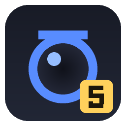

<p align="center">
  
</p>

# VRChat DLSS5 Cam

[English](../README.md) · [简体中文](README.zh-CN.md) · [日本語](README.ja.md) · **한국어**

VRChat DLSS5 Cam은 VRChat 내장 카메라(*Spout Stream*을 켠 Stream 카메라)의 화면을 가져와
**DLSS 5 뉴럴 렌더링(DLSSNR)** 으로 실시간 처리하고, 결과를 바로 보여주며 무손실 PNG 사진으로 저장합니다.
독립 실행형 Windows 앱이므로 VRChat에 아무것도 주입하지 않으며 모드도 필요 없습니다.

> **상태: 초기 프리뷰.** 바이너리는 GitHub Actions에서 빌드되며, 파이프라인은 아직 다양한 GPU와 DLSS 5 런타임 빌드에서
> 충분히 검증되지 않았습니다. 문제가 있으면 `log.txt`를 첨부하여 이슈를 열어 주세요.

## 기능

- DLSS 5 처리 후의 VRChat 카메라 화면을 **실시간 미리보기**. 와이프 비교, 원본, 모션 벡터 보기 지원.
- `nvngx_dlssnr.dll`을 직접 호스팅하는 **DLSS 5 뉴럴 렌더링**. RenoDX의 DLSS 5 ReShade 애드온과 같은 파라미터
  (프리셋, 스타일, 강도, 전역 톤, 지역 톤, 지역 구조, 피부 구조, 자동 마스크, UI 보정)를 제공합니다.
  변경 사항은 즉시 적용되며 정지된 프레임에서도 조정할 수 있습니다.
- **프레임 가이던스.** DLSSNR은 시간적 모델이므로 모션 벡터와 깊이가 필요합니다. 앱은 GPU에서(계층적 블록 매칭)
  이를 계산하거나, 사용 가능하면 **NVIDIA Optical Flow** 하드웨어 엔진을 사용하고, 뉴럴 렌더링 전에
  **DLAA**(네이티브 해상도 DLSS 안티앨리어싱) 패스를 추가할 수 있습니다.
- **적응형 해상도.** 송신자 해상도를 자동 감지합니다. 사용자 지정 출력 해상도를 설정할 수 있으며 DLSS 5가 직접 업스케일하도록 할 수 있습니다.
  장면 전환을 감지하여 시간 이력을 재설정합니다.
- **무손실 촬영.** 처리된 프레임(선택적으로 원본도)을 PNG로 저장. VRChat이 전면에 있어도 동작하는 전역 단축키
  (기본 `Ctrl+Alt+P`)와 타임랩스 모드 지원.
- **4개 언어**(English, 简体中文, 日本語, 한국어), Windows UI 언어에 따라 자동 선택.
- 모니터별 DPI 지원, 다크 테마 UI, GPU 타이머, 내장 로그.

## 요구 사항

| | |
|---|---|
| OS | Windows 10 21H2 / Windows 11, 64비트 |
| GPU | NVIDIA GeForce RTX(DLSS 5 뉴럴 렌더링은 RTX 하드웨어 전용), 최신 Game Ready 드라이버 |
| VRChat | Stream 카메라에 *Spout Stream* 옵션이 있는 빌드(데스크톱 또는 VR) |
| DLSS 5 런타임 | 직접 준비한 `nvngx_dlssnr.dll`. **이 프로젝트에는 포함되지 않으며 다운로드하지도 않습니다.** |

## 설정 방법

1. [Releases](https://github.com/AlanBacker/VRChat-DLSS5-Cam/releases)에서 `VRChatDLSS5Cam-win64.zip`을 내려받아 원하는 위치에 압축을 풉니다.
2. `nvngx_dlssnr.dll`을 압축 해제한 폴더(`VRChatDLSS5Cam.exe` 옆)에 복사합니다. *DLSS 5 뉴럴 렌더링 → 런타임 경로*에서 파일을 지정할 수도 있습니다.
3. VRChat을 실행하고 **카메라**를 연 뒤 카메라 모드를 **Stream**으로 전환하고, Stream 카메라 설정에서 **Spout Stream**을 켭니다. VRChat은 카메라 화면을 Spout 송신자(`VRCSender1`)로 내보냅니다.
4. `VRChatDLSS5Cam.exe`를 실행합니다. 송신자가 자동으로 연결되고 처리된 화면이 미리보기에 표시됩니다.
5. VRChat에서 구도를 잡고 **Ctrl+Alt+P**(또는 *촬영* 버튼)를 누릅니다. PNG는 기본적으로 `사진\VRChat DLSS5 Cam`에 저장됩니다.

팁
- Spout 스트림 해상도는 VRChat이 결정합니다. VRChat의 `config.json`에서 `camera_spout_res_width` / `camera_spout_res_height`를 높이면 더 높은 해상도의 입력을 얻을 수 있으며 앱이 자동으로 맞춥니다.
- 다른 출력 크기를 원하면 *소스* 섹션에서 *사용자 지정 해상도*를 켜세요. *DLSS 5 업스케일*을 켜면 DLSSNR이 더 큰 이미지를 직접 렌더링합니다.
- *와이프* 비교 모드에서 미리보기의 핸들을 드래그하면 각 파라미터의 효과를 확인할 수 있습니다.

## 파라미터

| 섹션 | 설정 | 의미 |
|---|---|---|
| DLSS 5 | 프리셋 | DLSSNR에 전달하는 렌더 프리셋 힌트(0–3). |
| DLSS 5 | 스타일 | `DLSSNR.Style`: 기본 / 자연 / 시네마틱. |
| DLSS 5 | 강도 | 뉴럴 패스의 전체 강도. |
| DLSS 5 | 전역 톤 / 지역 톤 | 전역 및 지역 톤 매핑 강도. |
| DLSS 5 | 지역 구조 / 피부 구조 | 디테일 강조. 피부 구조는 런타임 기본값으로 둘 수 있습니다. |
| DLSS 5 | 자동 마스크 / UI 보정 | 자동 피사체 마스크, UI 안전 처리. |
| DLSS 5 | 경로 | *서명된 스니펫*: `nvngx_dlssnr.dll`을 직접 호스팅. *NGX 코어*: NGX 런타임을 통해 기능 생성. |
| 프레임 가이던스 | 모션 벡터 | 없음(0), GPU 블록 매칭, NVIDIA Optical Flow(드라이버의 `nvofapi64.dll`). |
| 프레임 가이던스 | 깊이 | DLSSNR에 전달하는 깊이 버퍼: 평면 / 그라데이션 / 0. |
| 프레임 가이던스 | 자동 재설정 | 블록 매칭 비용으로 장면 전환을 감지하고 시간 이력을 지웁니다. |
| DLAA | 사용 / 프리셋 | 뉴럴 렌더링 전 네이티브 해상도에서의 선택적 DLSS 안티앨리어싱. |
| 촬영 | 알파 유지 / 원본도 저장 / 단축키 / 타임랩스 | 촬영 옵션. |
| 표시 | 비교 / 맞춤 / VSync / 오버레이 | 미리보기 옵션. |

설정은 `%LOCALAPPDATA%\VRChatDLSS5Cam\settings.ini`에 저장되며 로그는 같은 폴더의 `log.txt`입니다.

## 문제 해결

- **"Spout 송신자 대기 중"** – VRChat의 Stream 카메라에서 *Spout Stream*을 켜고 카메라를 연 상태로 두세요. 다른 Spout 송신자는 *송신자* 콤보에 표시됩니다.
- **"nvngx_dlssnr.dll을 찾을 수 없습니다"** – 런타임을 실행 파일 옆에 복사하거나 경로를 선택하세요.
- **NGX 초기화 안 됨 / DLAA 지원 안 됨** – NGX 런타임에는 NVIDIA GPU와 최신 드라이버가 필요합니다. DLSSNR은 *서명된 스니펫* 경로로 계속 동작합니다.
- **뉴럴 렌더링 실패** – 일부 런타임 빌드는 더 새로운 드라이버가 필요합니다. `log.txt`의 NGX 결과 코드를 확인하고 *프리셋* 0과 *NGX 코어* 경로를 시도해 보세요.
- **낮은 프레임률** – DLAA를 끄거나 검색 반경을 줄이거나 모션 벡터에 NVIDIA Optical Flow를 선택하세요.

## 소스에서 빌드

필요 사항: Visual Studio 2022(MSVC v143, Windows 10 SDK) 및 CMake 3.21 이상.

```powershell
git clone https://github.com/AlanBacker/VRChat-DLSS5-Cam.git
cd VRChat-DLSS5-Cam
cmake -S . -B build -A x64
cmake --build build --config Release --parallel
```

구성 단계에서 NVIDIA의 공개 GitHub 저장소로부터 NVIDIA DLSS SDK(헤더, `nvsdk_ngx_s.lib`, `nvngx_dlss.dll`)를 내려받습니다.
셰이더는 실행 시 컴파일되므로 별도의 셰이더 도구 체인이 필요 없습니다.

## 동작 원리

```
VRChat Stream 카메라 ──Spout──▶ D3D11on12 수신 ──▶ 변환(sRGB / 크기 조정)
      ▶ 휘도 피라미드 ──▶ 블록 매칭 / NVIDIA Optical Flow ──▶ 모션 벡터 + 깊이
      ▶ [DLAA] ──▶ DLSSNR(nvngx_dlssnr.dll) ──▶ 합성 / 비교 ──▶ 미리보기 + PNG 촬영
```

이 앱은 NGX 런타임 바깥에서 DLSS 5 뉴럴 렌더링 스니펫을 호스팅합니다. DLL을 직접 로드하고
모듈 이름 검사를 통과시키며 `DLSSNR.*` NGX 파라미터 규약으로 D3D12 컴퓨트 큐에서 기능을 생성하고 평가합니다.
자세한 내용은 `src/ngx/DlssnrFeature.cpp`를 참고하세요.

## 라이선스

MIT(`LICENSE` 참고). 서드파티 구성 요소와 NVIDIA 고지는 `THIRD_PARTY_NOTICES.md`에 있습니다.
이 프로젝트는 VRChat Inc. 또는 NVIDIA Corporation과 무관합니다. DLSS 5 런타임은 미출시 소프트웨어입니다.
사용에 따른 책임은 본인에게 있으며, 이 앱과 함께 재배포하지 마세요.
