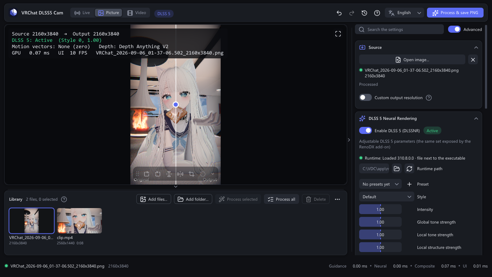
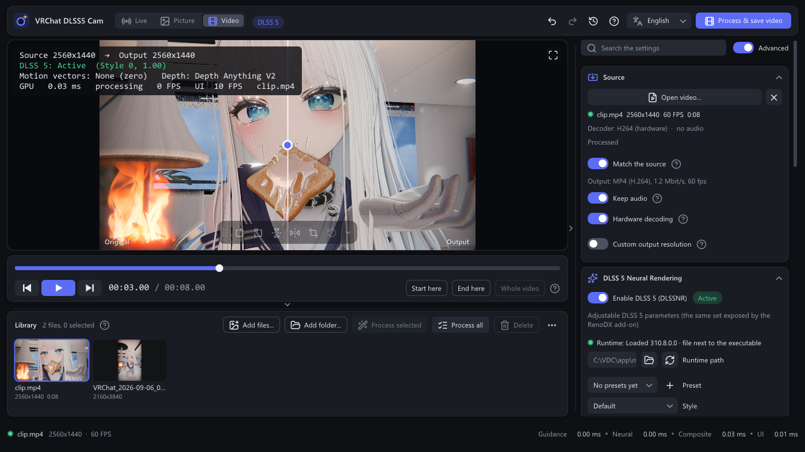
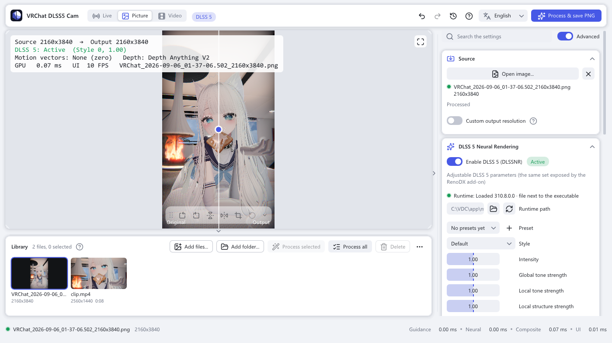

<p align="center">
  
</p>

# VRChat DLSS5 Cam

[English](../README.md) · **简体中文** · [日本語](README.ja.md) · [한국어](README.ko.md)

VRChat DLSS5 Cam 会捕获 VRChat 相机的画面，在你的 GeForce RTX 显卡上用 **DLSS 5 神经渲染** 处理，
并把结果保存为无损 PNG 照片。磁盘上的图片和视频同样可以处理，单个或批量都行。
它是一个普通的 Windows 程序：不向 VRChat 注入任何东西，也不需要 Mod。

<p align="center">
  
</p>

[](https://github.com/AlanBacker/VRChat-DLSS5-Cam/actions/workflows/build.yml)
[](https://github.com/AlanBacker/VRChat-DLSS5-Cam/releases/latest)

## 它能做什么

- **实时相机。** 实时显示经过 DLSS 5 处理的 VRChat Stream 相机画面，用热键（`Ctrl+Alt+P`）保存 PNG 照片，
  VRChat 在前台时热键同样有效。
- **磁盘上的图片和视频。** 把截图或录像拖进窗口，在它上面调节滑块，然后保存结果：图片保存为 PNG，
  视频保存为 MP4（H.264 / HEVC，保留音频）或 PNG 序列。
- **一次处理多个文件。** 打开过的文件都会进入预览下方的素材库。选中部分或全部，一次处理完，
  每个文件用共同的设置或各自的单独参数。
- **真正的 DLSS 5 引导。** 神经网络会收到 NVIDIA Optical Flow 的运动矢量和 Depth Anything V2 的深度图，
  视频和实时相机都按游戏里的方式处理。可选的 DLAA 预处理先把边缘清理干净。
- **方便对比。** 分割对比、并排或原始画面，鼠标滚轮缩放，拖动平移。
- **为日常使用而做。** 深色和浅色外观（默认跟随 Windows），撤销和重做并附带完整的历史记录列表，可调整的界面布局，
  自动检查新版本，四种语言（English、简体中文、日本語、한국어），界面在独立线程上运行、始终流畅，
  还有命令行用于脚本化处理。

## 你需要什么

| | |
|---|---|
| Windows | Windows 10 21H2 或 Windows 11，64 位 |
| 显卡 | NVIDIA GeForce RTX。**RTX 50** 系列用常规运行库即可运行神经渲染；**RTX 40 / 30 / 20** 需要修改版运行库（见下一行），用常规版本时程序会报告失败并继续工作，只是没有神经渲染。 |
| DLSS 5 运行库 | 你自己的 `nvngx_dlssnr.dll`。**本项目不包含、也永远不会下载该文件。** 该文件可以在 [RenoDX 的 Discord 服务器](https://discord.com/invite/renodx) 获取，那里也有适用于 RTX 50 系列以外显卡的修改版。该服务器属于 RenoDX 项目，**不是本项目的 Discord**；本项目没有自己的 Discord 服务器。 |
| VRChat | 任何带有 Stream 相机 *Spout Stream* 选项的版本（桌面或 VR）。只有实时相机需要。 |
| 视频文件 | Windows Media Foundation（Windows 自带）。N / KN 版本需要安装 *Media Feature Pack*；HEVC 文件可能需要 Microsoft Store 里的 *HEVC 视频扩展*。 |

## 快速上手

1. 从[最新版本](https://github.com/AlanBacker/VRChat-DLSS5-Cam/releases/latest)下载 `VRChatDLSS5Cam-win64.zip`，解压到任意位置。
2. 把你的 `nvngx_dlssnr.dll` 复制到该文件夹，与 `VRChatDLSS5Cam.exe` 放在一起。（之后也可以在 *DLSS 5 神经渲染 → 运行库路径* 里指定文件位置。）
3. 在 VRChat 里打开**相机**，切换到 **Stream** 模式，并在其设置里启用 **Spout Stream**。
4. 启动 `VRChatDLSS5Cam.exe`。相机画面会出现在预览里，DLSS 5 已经生效；*启用 DLSS 5* 开关旁边的标记显示 *运行中*。
5. 在 VRChat 里取好景，按 **Ctrl+Alt+P**（或 *拍照* 按钮）。PNG 会保存到 `图片\VRChat DLSS5 Cam`。

实时相机的小技巧

- 串流分辨率由 VRChat 决定。在 VRChat 的 `config.json` 里调高 `camera_spout_res_width` / `camera_spout_res_height` 可以得到更清晰的输入；程序会自动适应。
- 如果你的显卡跑实时预览太慢，打开 DLSS 5 分节里的 *仅拍照时运行神经渲染*：预览显示原始画面，神经渲染、运动和深度这几步全部停下，每次拍照时只为这张照片运行神经渲染。
- *显示* 分节里的 *处理帧率上限* 限制每秒处理的相机帧数，把 GPU 留给 VRChat。

## 磁盘上的图片和视频

把图片或视频拖进窗口，或者用 *视频源* 分节里的 *打开图片…* / *打开视频…*。画面出现在预览里，所有滑块立刻可以在它上面调节。
*打开…* 旁边的 ✕ 按钮可以再把文件关掉：处理停止，预览清空，文件仍留在素材库里。
按 **处理并保存 PNG**（图片）或 **处理并保存视频**（视频），或者按热键，结果会保存在你的照片旁边，
文件名为 `<名称>_DLSS5_<宽>x<高>.png`、`.mp4` 或一个装着 PNG 帧的文件夹。

<p align="center">
  
</p>

对于视频，预览下方的控件可以让文件经过整条流水线播放和暂停、逐帧步进，把鼠标悬停在进度条上会显示该位置的小画面。
*起点设在这里* / *终点设在这里* 把处理范围（以及音频）限制在一段之内；*整段视频* 取消限制。
默认输出与原视频规格一致：相同的编码、帧率和码率。关掉 *同步原视频规格* 就可以自己选择 H.264、HEVC 或 PNG 序列以及码率。
*拍照* 分节会显示当前设置下这个文件大约需要多久。

## 一次处理多个文件

打开或拖入的每个文件都会进入预览下方的**素材库**（*添加文件…* 和 *添加文件夹…* 可以添加更多）。
**双击**缩略图即可在预览里打开该文件，并在它上面调节滑块。单击只选中这一个文件；**Ctrl+点击** 加选或取消一个，
**Shift+点击** 从上次点击的文件起连续选择，在空白处拖动可以框选，缩略图上的方框也能勾选，**Ctrl+A** 选中所有
可读取的文件。鼠标位于素材库上时（或最后一次点击落在素材库里时），按 **Delete** 键可以把选中的素材移出素材库，
磁盘上的文件不会被删除。然后 *处理选中* 或 *全部处理* 会依次处理这些文件；每个缩略图上的进度条显示进度，
处理完后状态仍然可见。

在缩略图上按鼠标右键会打开菜单：在资源管理器中显示文件、从素材库移除，或者在单独的窗口里给它设置
**单独的 DLSS 5 参数**。选中了多个文件时，同一个菜单会提供 *为 N 个素材设置单独参数…*，一次为它们全部设置数值；
之后每个文件各自保留一份。

## 界面导览

- **三个分节完成日常工作：** *视频源*（输入什么）、*DLSS 5 神经渲染*（效果如何）和 *拍照*（保存到哪里），
  之后是 *显示* 和 *关于*。DLSS 5 分节里的 *高级* 开关显示或隐藏色调和结构滑块、输出混合、排在 *拍照* 之后的
  *帧引导* 与 *DLAA 预处理* 两个分节，以及排在 *关于* 之前、带计时器的 *内部信息*。
- **对比** 可用分割对比（在预览里拖动分隔线）、并排或原始画面。在预览上滚动鼠标滚轮以光标为中心缩放，
  拖动平移，双击回到适应窗口。
- **撤销和重做** 任何设置更改，以及素材库里文件的添加和删除：**Ctrl+Z** / **Ctrl+Y**，或顶栏里的两个箭头。
  两个箭头旁边的时钟按钮会打开 **历史记录**：所有记录下来的更改都按顺序列出（*强度：1.2*、*添加 photo.png*、
  *移除 3 个文件*、*photo.png：自有参数*），当前状态高亮显示，已被撤销的状态以灰色排在它后面。点击其中任意一条
  就能回到那个状态；在你做出新的更改之前，后面的条目都还留着，可以随意来回切换。最多保留 100 步。
- **全屏** 用预览角落的按钮或 **F11**：整个屏幕只显示画面。鼠标移动时显示视频控制条；**Esc** 或 **F11** 退出。
- **深色或浅色。** *显示* 分节里的 *主题*：*跟随系统* 按 Windows 的应用颜色设置切换，也可以直接选 *深色* 或 *浅色*。
- **侧栏** 可以通过边缘细长的把手收起：单击隐藏或显示，拖动把手改变侧栏宽度。素材库也一样——拖动它的上边缘，
  缩略图会随之变大或变小。两个尺寸都会记住，下次启动继续沿用。处理文件期间侧栏会锁定，并提供 *取消*。
- **启动时** 会先显示一张小卡片，上面有图标、名称、版本、一行状态和一条走动的进度条；主窗口要等到第一帧
  准备好才出现，因此启动时不会看到空白窗口。

<p align="center">
  
</p>

### 键盘和鼠标

| 按键 | 作用 |
|---|---|
| `Ctrl+Alt+P` | 为实时相机拍照，或处理打开的图片 / 视频（全局热键，可在 *拍照* 分节里修改） |
| `Ctrl+Z` · `Ctrl+Y` / `Ctrl+Shift+Z` | 撤销 · 重做设置更改或素材库更改（顶栏的时钟按钮列出全部） |
| `F11` · `Esc` | 全屏预览 · 退出全屏 |
| `Ctrl+A` · `Delete` | 选中素材库里所有可读取的文件 · 把选中的移出素材库，磁盘上的文件保留（鼠标位于素材库上） |
| `空格` | 播放 / 暂停打开的视频 |
| `←` `→`（`Shift`：10 帧）· `Home` `End` | 逐帧步进 · 跳到开头 / 结尾 |
| `I` · `O` | 设置处理范围的起点 · 终点 |
| 预览上滚动滚轮 · 拖动 · 双击 | 缩放 · 平移 · 回到适应窗口 |
| 单击缩略图 · 双击 · `Ctrl`+点击 · `Shift`+点击 · 右键 | 只选中该文件 · 在预览里打开 · 加选或取消一个 · 连续选择 · 打开菜单 |
| 在素材库空白处拖动 · 拖动素材库上边缘 · 拖动侧栏把手 | 框选 · 素材库高度 · 侧栏宽度 |

## 保持最新版本

每次启动时，程序都会向 GitHub 查询该通道上最新的发布版本，如果它比你正在用的版本更新，就会告诉你。
*关于* 分节里的 *更新通道* 提供两个通道：**稳定版**（只有正式发布的版本）和 **预览版**（也包括正式发布前
用于测试的版本）。*启动时检查更新* 可以关掉这项检查，*检查更新* 按钮随时都能手动检查一次，
最近一次检查的结果显示在它下方。

发现更新的版本时会弹出一个窗口，显示版本号、发布日期和发布说明，并带三个按钮。**立即更新** 会把发布用的 zip
下载到 `%LOCALAPPDATA%\VRChatDLSS5Cam\update`，解压后关闭程序、替换程序文件，再重新启动程序；你的设置、
素材库以及程序文件夹里你自己的 `nvngx_dlssnr.dll` 都不会被改动。**查看发布页** 在浏览器里打开该版本，
**以后再说** 关闭窗口。程序所在的文件夹必须可写——`Program Files` 下的文件夹通常不可写；这时程序会提示，
你可以从发布页手动更新。检查失败或更新失败都会以通知的形式显示。

程序唯一的联网行为就是这个发往 `api.github.com` 的请求（以及你选择更新时从 `github.com` 下载文件），
除此之外不会发送任何东西。无窗口运行和 `--process` 运行不会自动检查更新。

## 设置说明

<details>
<summary>按分节列出的全部设置</summary>

| 分节 | 设置 | 含义 |
|---|---|---|
| 视频源 | 输入 | *VRChat 相机（Spout）*、*图片文件* 或 *视频文件*。 |
| 视频源 | Spout 发送端 | 接收哪个 Spout 发送端；VRChat 的相机是 `VRCSender1`。 |
| 视频源 | 自定义处理分辨率 | 用你指定的尺寸而不是源尺寸处理，可选让 DLSS 5 放大到该尺寸。 |
| 视频源 | 同步原视频规格 | 仅视频，默认开启：输出使用原文件的编码（H.264 或 HEVC）、帧率和平均码率。 |
| 视频源 | 保存为 / 码率 / 保留音频 | 关闭 *同步原视频规格* 后：*MP4 (H.264)*、*MP4 (HEVC)* 或 *PNG 序列*，编码器码率（5–200 Mbit/s），以及是否复制音轨。 |
| 视频源 | 硬件解码 | 在 GPU 上解码视频。如果某个文件颜色不对或打不开，把它关掉。 |
| 视频源 | 白点 / 高光压缩 | 只在浮点（HDR）Spout 纹理时显示：神经渲染之前的曝光参考和柔和的高光压缩。 |
| DLSS 5 | 启用 DLSS 5（DLSSNR） | 打开或关闭神经渲染。关闭会释放运行库；打开时重新从文件加载。 |
| DLSS 5 | 运行库路径 / 重新加载 | `nvngx_dlssnr.dll` 的位置。*重新加载* 重新读取该文件。 |
| DLSS 5 | 加载方式 | *直接加载（signed snippet）*：直接托管 `nvngx_dlssnr.dll`。*NGX 核心*：通过 NGX 运行时创建功能。 |
| DLSS 5 | 预设 / 风格 | 传给运行库的渲染预设（0–3）和风格（默认 / 自然 / 电影）。 |
| DLSS 5 | 强度 | 神经渲染的整体强度，0–2。1 以内是运行库自身的强度；超过 1 时程序放大神经结果与原图的差异（也可能放大瑕疵）。为 0 时画面保持不变。 |
| DLSS 5 | 全局色调强度 / 局部色调强度 | 全局和局部色调强度，0–2，超过 1 的规则相同（超过 1 的最大值决定增益）。 |
| DLSS 5 | 局部结构强度 / 皮肤结构强度 | 细节增强，0–2，超过 1 的规则相同。皮肤结构可以保留运行库默认值。 |
| DLSS 5 | 自动遮罩 / UI 校正 | 自动主体遮罩、对 UI 安全的处理。 |
| DLSS 5 | 仅拍照时运行神经渲染 | 适合实时使用太慢的显卡：两次拍照之间神经渲染、运动和深度这几步全部停下，显卡几乎空闲；拍照时先对 16 帧新画面运行神经渲染（开着深度引导时，从第一次深度估计之后算起）再保存。静态图片不受影响。 |
| DLSS 5 | 输入曝光 / 色调传递 / 色彩强度 | 输出混合。输入曝光（0.25–4×）缩放网络看到的画面，之后再还原。色调传递和色彩强度（0–2）决定神经渲染的亮度和色彩变化有多少进入输出；1 / 1 完全等于神经结果，0 保留原图。 |
| DLSS 5 | 阴影强度 / 高光与辉光强度 | 输出混合，0–2：神经渲染的压暗和提亮各有多少进入输出。1 / 1 = 按渲染结果。 |
| DLSS 5 | 神经渲染分辨率 | 用更小的画面（输入的 25–100 %）运行神经渲染，把它的变化放大后叠加到全分辨率画面上。数值越低 GPU 负担越小，代价是最细的细节。神经放大开启时不使用。 |
| 拍照 | 保存文件夹 / 保留透明度 / 同时保存原始画面 / 全局热键 / 自动拍照间隔 | 照片和视频保存的位置与方式。 |
| 拍照 | 预计处理时间 | 当前设置下打开的图片或视频的大致处理时间，每次运行后会修正。 |
| 帧引导 | 运动矢量 | NVIDIA Optical Flow（带前向 / 后向一致性检查）、GPU 块匹配或无。 |
| 帧引导 | 深度 | AI 估计（DirectML 上的 Depth Anything V2 Small；更新间隔和网络分辨率可调）、平面、渐变或零。 |
| 帧引导 | 自动重置 | 在场景切换时清空时序历史。默认关闭。 |
| DLAA 预处理 | 启用 / 预设 | 可选的 DLSS 抗锯齿，在神经渲染之前以原生分辨率运行。 |
| 显示 | 主题 | *跟随系统*（按 Windows 设置）、*深色* 或 *浅色*。 |
| 显示 | 对比 / 适应窗口 / 缩放 / 垂直同步 / 显示叠加信息 / 显示素材库 | 预览选项。 |
| 显示 | 处理帧率上限 | 实时相机：每秒最多处理这么多帧，其余跳过。0 = 每一帧。 |
| 关于 | 启动时检查更新 / 更新通道 / 检查更新 | 每次启动时查找更新的版本（默认开启），通道可选 *稳定版* 或 *预览版*，也可以用按钮立即检查一次。最近一次检查的结果显示在下方。 |
| 关于 | 打开日志文件 / 打开设置文件夹 / 项目主页 / 第三方声明 / 重置所有设置 | 版本、GPU 和驱动信息，以及维护按钮。 |

设置保存在 `%LOCALAPPDATA%\VRChatDLSS5Cam\settings.ini`；日志是同一文件夹里的 `log.txt`。

</details>

命令行选项（打开文件、无人值守处理、截图、无窗口运行）见 [COMMAND_LINE.md](COMMAND_LINE.md)（英文）。

## 常见问题

- **"等待 VRChat Spout 串流…"** – 在 VRChat 的 Stream 相机上启用 *Spout Stream*；相机必须处于打开状态。其他 Spout 发送端会列在 *Spout 发送端* 框里。
- **"找不到 nvngx_dlssnr.dll"** – 把运行库复制到 `VRChatDLSS5Cam.exe` 旁边，或在 DLSS 5 分节里选择它的路径。
- **神经渲染失败** – RTX 40 / 30 / 20 搭配常规运行库时这是正常的：该版本只包含 RTX 50 的代码，程序会在错误下方说明。请到 RenoDX 的 Discord 服务器获取修改版（见 *你需要什么*；与本项目无关）。否则，某些运行库版本需要更新的驱动；查看 `log.txt` 里的 NGX 结果代码，并尝试 *预设* 0 和 *NGX 核心* 加载方式。
- **神经渲染运行中，但画面是黑的或没有变化** – 程序会把每一帧神经结果与输入对比，当运行库报告成功却输出黑屏或与输入相同的画面时发出警告（`log.txt`："DLSSNR output check"）。把 DLSS 5 关掉再打开即可重新开始。如果依然如此，说明该运行库版本在这块 GPU 上不产生画面。（*强度* 为 0 时画面不变是正常的，不会显示警告。）
- **程序无法启动 / 立即关闭** – 打开 `%LOCALAPPDATA%\VRChatDLSS5Cam\`，查看 `log.txt`（最后一行是失败的步骤）和 `crash.txt`。提 issue 时请附上这两个文件。
- **NGX 未初始化 / DLAA 不支持** – NGX 运行时需要 NVIDIA GPU 和较新的驱动。DLSS 5 仍可通过 *直接加载（signed snippet）* 方式工作。
- **深度估计器不可用** – `onnxruntime.dll`、`onnxruntime_providers_shared.dll`、`DirectML.dll` 和 `models\depth_anything_v2_small_fp16.onnx` 必须与可执行文件放在一起（发布包里都有）。估计器就绪之前程序使用零深度；状态显示在 *帧引导* 下方。
- **光流不可用** – 如果 `log.txt` 里出现 "NVOF unavailable, falling back to block matching"，请更新 GeForce 驱动；在此之前使用块匹配。*帧引导* 下方的状态点显示当前使用的来源。
- **视频预览是黑的** – 很多影片以从黑场淡入开始；预览会跳过这些帧，如果显示的帧仍然很暗，会在画面下方说明。用进度条或方向键向后找。
- **视频打不开 / 没有可用的编码器** – 支持的格式取决于 Windows 里安装的编解码器。HEVC 文件请安装 *HEVC 视频扩展*（Microsoft Store），Windows N / KN 请安装 *Media Feature Pack*。缺少 H.264 编码器时，选择 *PNG 序列* 作为输出。关闭 *硬件解码* 有助于处理 GPU 解码器拒绝的文件。
- **帧率低** – 关闭 DLAA，调大深度更新间隔或调低深度网络分辨率，调低神经渲染分辨率，或设置处理帧率上限。光流网格保持 4 px（2 px 和 1 px 在 4K 下开销大得多）。日志每 15 秒打印一行 `Perf:`，列出各阶段的开销。
- **无法安装更新** – 程序所在的文件夹必须可写，而 `Program Files` 下的文件夹通常不可写。把程序移到你自己的文件夹里，或者从发布页下载新版本并手动替换文件；设置和素材库都会保留。

## 从源码构建

需要：Visual Studio 2022（MSVC v143，Windows 10 SDK）和 CMake 3.21+。

```powershell
git clone https://github.com/AlanBacker/VRChat-DLSS5-Cam.git
cd VRChat-DLSS5-Cam
cmake -S . -B build -A x64
cmake --build build --config Release --parallel
```

配置阶段会从 NVIDIA 的公开 GitHub 仓库下载 NVIDIA DLSS SDK（头文件、`nvsdk_ngx_s.lib`、`nvngx_dlss.dll`），从 NuGet 下载
ONNX Runtime（DirectML 版本）和 DirectML，从 Hugging Face 下载 Depth Anything V2 Small FP16 模型
（`-DVDC_FETCH_DEPTH_MODEL=OFF` 可跳过模型）。所有下载都经过哈希校验。着色器在运行时编译，不需要着色器工具链。
DLSS 5 运行库永远不是构建或发布包的一部分。

## 工作原理

<details>
<summary>流水线与设计说明</summary>

```
VRChat Stream 相机 ──Spout──▶ D3D11on12 接收 ──▶ 转换（sRGB / 缩放）
      ▶ NVIDIA Optical Flow（前向 + 后向）/ 块匹配 ──▶ 运动矢量 + 置信度
      ▶ Depth Anything V2（ONNX Runtime DirectML，每 N 帧一次）──▶ 归一化深度，其间沿运动矢量重投影
      ▶ [DLAA] ──▶ DLSSNR（nvngx_dlssnr.dll）──▶ 合成 / 对比 ──▶ 预览 + PNG 拍照
视频文件 ──Media Foundation──▶ 解码（GPU）──▶ 同一条流水线，逐帧 ──▶ MP4（H.264 / HEVC + AAC）或 PNG 序列
```

程序在 NGX 运行时之外托管 DLSS 5 神经渲染 snippet：直接加载 DLL，满足其模块名检查，并使用 `DLSSNR.*` NGX 参数约定
在 D3D12 队列上创建和评估功能（`src/ngx/DlssnrFeature.cpp`）。参数与 RenoDX 的 DLSS 5 插件暴露的是同一组。

引导方案针对视频输入设计：同分辨率 SDR 输入；硬件光流，在前向与后向矢量不一致处降低置信度；Depth Anything V2 的单目深度
按 2% / 98% 分位归一化为反转的相对深度，并在两次推理之间沿运动矢量传递；不做逐帧历史重置。所有这些都是独立的 MIT 实现
（`src/gfx/Pipeline.cpp`、`src/gfx/DepthEstimator.cpp`、`src/gfx/Shaders.cpp`）。光流引擎运行在一个私有的原生 D3D11 设备上；
帧和矢量通过 NT 句柄共享纹理传到 D3D12，并由共享栅栏保证顺序（`src/gfx/NvOpticalFlow.cpp`）。

两个线程共享 GPU：处理线程拥有 Spout 接收器（或文件）、流水线和自己的 D3D12 队列；界面线程拥有窗口、ImGui 和一个高优先级的
呈现队列。完成的画面通过显示缓冲区交接，跨队列用栅栏等待，因此预览始终显示最新完成的一帧，窗口从不等待神经渲染
（`src/core/App.cpp`、`src/gfx/Device.cpp`）。静态图片用 WIC 解码（应用 EXIF 方向），上传一次后以零运动经过同一条流水线
反复处理若干遍，直到时序网络稳定。

视频文件由 Media Foundation 源读取器在独立线程上解码（通过 DXGI 设备管理器使用硬件解码器，软件回退）到一个短的帧队列。
处理线程每次把一帧交给流水线，并请求回读该帧的结果；回读按帧序收集后交给写入器，因此即使神经渲染慢于帧间隔，
也不会跳帧或重复帧。写入器在自己的线程上把每帧转换成 NV12，连同解码出的音频样本一起送入 Media Foundation 接收器写入器
（有硬件编码器时使用）（`src/core/VideoSource.cpp`、`src/core/VideoWriter.cpp`）。

</details>

## 许可证

MIT（见 `LICENSE`）。第三方组件和 NVIDIA 声明列在 `THIRD_PARTY_NOTICES.md`。
本项目与 VRChat Inc. 或 NVIDIA Corporation 无关。DLSS 5 运行库是未发布的软件；使用风险自负，
且切勿随本程序一起再分发。
